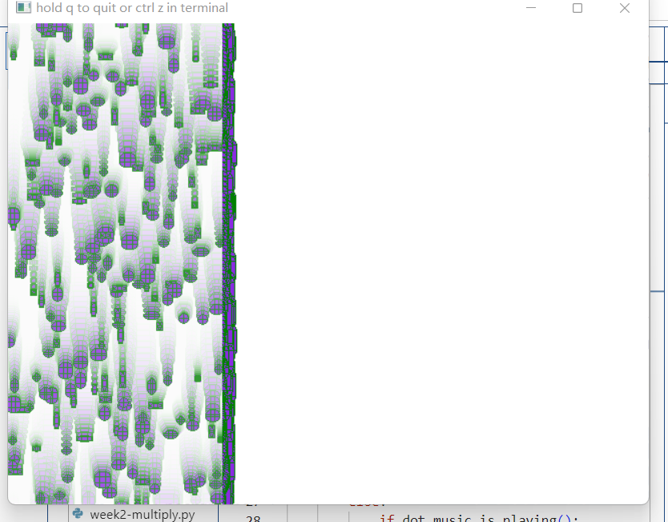

# Week 3 week 8 week 5 

I was inspired by healing design, I wanted to make a screen interactive module with a gradient effect for people to relax, combined with some soothing music people can see the vibration of the module and add some interactive effects.


I explore audio, the interaction of the mouse with geometric shapes, adding the visual sensation that randomness brings to the table

## Rectangle With Rounded Corners 
([see code](week2\Week 3 Week 5 Week8- Vision.py)).
np.random.randint() takes (low, high, size) to generate sets of random numbers.
([see code](week4-guitar1.py)）
```python
self.num_rects_left = 50 
self.rect_positions_left = np.random.randint(0, [dot.width // 3, dot.height], (self.num_rects_left, 50))
self.rect_speeds_left = np.random.randint(1, 7, 100) 
self.rect_sizes_left = np.random.randint(6, 30, (self.num_rects_left, 2))#
```


(Available at: https://docs.opencv.org/4.x/dc/da5/tutorial_py_drawing_functions.html (Accessed: 21 October 2024).)
I wanted to make the rectangle look softer so I researched rounded rectangles and ellipses and I think rounded rectangles fit my picture better I used a combination of ``cv2.ellipse`` and ``cv2.rectangle`` functions to generate the def draw_rounded (custom method) I defined ``img``, ``centre``, ``size``, ``radius``,``fill_color``, ``border_color`` to refine the rectangle respectively. 
``x, y = centre and w, h = size:`` unwraps centre and size into x, y and w, h.

```python
        rectangle(img, (x - w//2 + radius, y - h//2), (x + w//2 - radius, y + h//2), fill_color, -1)
        rectangle(img, (x - w//2, y - h//2 + radius), (x + w//2, y + h//2 - radius), fill_color, -1)
        ellipse(img, (x - w//2 + radius, y - h//2 + radius), (radius, radius), 180, 0, 90, fill_color, -1)
        ellipse(img, (x + w//2 - radius, y - h//2 + radius), (radius, radius), 270, 0, 90, fill_color, -1)
        ellipse(img, (x - w//2 + radius, y + h//2 - radius), (radius, radius), 90, 0, 90, fill_color, -1)
        ellipse(img, (x + w//2 - radius, y + h//2 - radius), (radius, radius), 0, 0, 90, fill_color, -1)
```
At first I could only achieve one colour, （E:\vscode\STEM-4-Creatives-24-25\week2\audio\1.png）after many attempts I split the screen into three parts ``dot.width // 3, dot.height`` which means that the random integers generated range from 0 to ``dot.width // 3`` in the x-direction, but the edges of the screen were always left with a very noticeable mark, which changed when I finished drawing the middle and the right. changed.
([see code](E:\\vscode\\STEM-4-Creatives-24-25\\week2\\Week 3 Week 5 Week8-Initial Version.py)). 
（E:\vscode\STEM-4-Creatives-24-25\week2\audio\Week 3 Week 5-Initial Vision.mp4）
## audio

dot.start_record() records the audio amplitude to update the position and size of the rounded rectangle  
Dynamically adjusts to amplitude. ``amplitude * 10`` amplifies the effect of amplitude, making the size of the rectangle vary with the intensity of the music.

```python
                for i in range(self.num_rects_left):
            pos = self.rect_positions_left[i]
            speed = self.rect_speeds_left[i]
            amplitude = dot.music.amplitude()
            size = (int(self.rect_sizes_left[i][0] * (1 + amplitude * 10)),
                    int(self.rect_sizes_left[i][1] * (1 + amplitude * 10)))

            pos[1] = (pos[1] + speed) % dot.height
```
## Gradient and Transparency

In order to achieve the desired effect of the rectangle gradient screen I followed week3-final-snow and added a ``cover = dot.get_layer`` semi-transparent cover layer calling the draw_layer method of the Dorothy object to draw the ``cover_left``, middle, and right layers to the canvas and set the transparency to 0.2. This makes the middle cover layer of the rectangle semi-transparent. This makes the middle cover layer of the rectangle semi-transparent. And I added a border colour to the rectangle to make it more layered:

```python
self.draw_rounded_rect(dot.canvas, pos, size, 5, dot.green, dot.red)。
```

## Mistake
（E:\vscode\STEM-4-Creatives-24-25\week2\audio\pass.mp4）
I tried using week05 ``fft dot.music.fft()`` to experiment with how different bands could control aspects of the visualisation, white green, or changing the background to an oval. But this made the background too cluttered so I abandoned this approach.
（week2\audio\2.png）
```python
    def setup(self):
        file_path = 
        "E:\\vscode\\STEM-4-Creatives-24-25\\week5\\audio\\mixkit-slow-dive-121.mp3"
        dot.music.start_file_stream(file_path, fft_size=512, buffer_size=512)
#(Available at: https://mixkit.co/free-stock-music/tag/futuristic/ (Accessed: 17 November 2024).)
    def draw(self):
        dot.background(dot.aqua)
        center = (dot.width // 2, dot.height // 2)
        max_radius = min(dot.width, dot.height) // 2

        for bin_num, bin_val in enumerate(dot.music.fft()[:256]):
            angle = bin_num * (360 / 256)
            radius = int(bin_val * max_radius)
            axes = (radius, radius // 2)  
            color = (0, 255, 0)
            thickness = 2
            ellipse(dot.canvas, center, axes, angle, 0, 360, color, thickness)
```
E:\vscode\STEM-4-Creatives-24-25\week2\audio\2.png
E:\vscode\STEM-4-Creatives-24-25\week2\audio\3.png

## Mouse 
(Available at: https://numpy.org/doc/stable/reference/generated/numpy.linalg.norm.html (Accessed: 19 October 2024).)
Inspired by the mouse interaction  I tried a way to keep the subject object away from the mouse by calculating the direction vector between the object and the mouse position. ``np.linalg.norm`` calculates the Euclidean distance between the direction vector direction, i.e., the distance between the rectangle and the mouse
```python
            mouse_pos = np.array([dot.mouse_x, dot.mouse_y])
            direction = pos - mouse_pos
```
Calculate the distance between the object and the mouse position, if the distance is less than 100 pixels, normalise the direction vector so that its length is 1. Update the position pos of the object according to the direction vector and the speed speed to move it away from the mouse position, using the if function.

```python
            distance = np.linalg.norm(direction)
            if distance < 100:  
                direction = direction / distance  
                pos += (direction * speed).astype(int) 
```    
## Conclude 

In the process of drawing the image I tried different methods of graphic drawing, I referenced many unplanned methods to achieve my intended goal, I tested different ways of responding to the audio, and although there were many features that I could not achieve, such as the gradient effect that I wanted, I did my best to make it a rich layer of colours that might make the image more pleasing to the eye.
Reflection.
There is also a lot of repetition in the code, and the structure and repetition could be improved in the future through deeper understanding and concise generalisations. But I will continue to flesh out my work until I am satisfied.